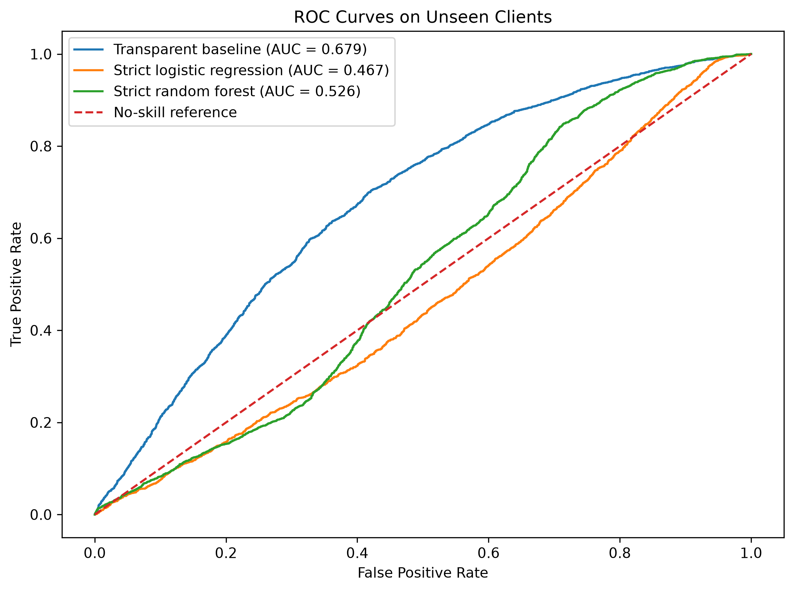
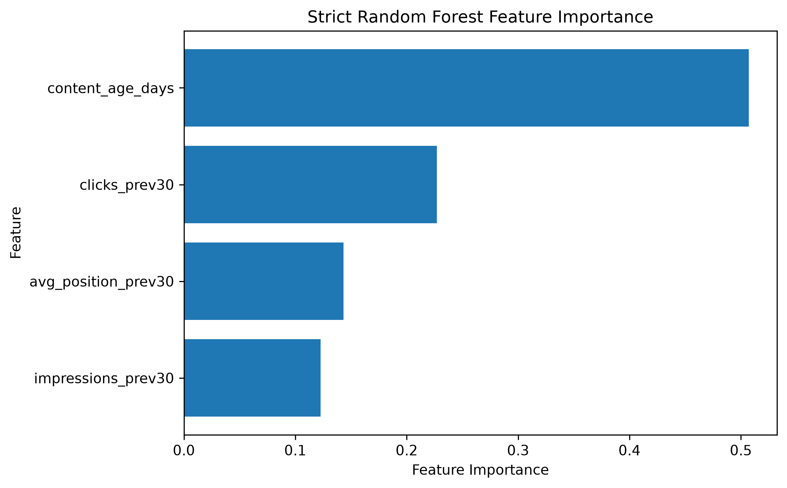

# Capstone Report — Content Refresh Risk Screening

- **Author:** Muhammad Mansoor Ur Rehman
- **Lane:** Content Refresh — Classification and Ranking
- **Repository:** https://github.com/imnxr/flyrank-ml-internship
- **Date:** 2026-07-30

## 0. Abstract

This project asks whether historical Google Search Console performance can identify content pages likely to experience a substantial decline in impressions during the following 30 days for previously unseen clients. The analysis used 101,362 eligible pages from 44 pseudonymous clients, with a non-overlapping 30-day feature window and 30-day outcome window. A transparent refresh-priority baseline was compared with leakage-safe logistic-regression and random-forest models using a client-grouped holdout split. The transparent baseline achieved the strongest unseen-client ranking performance, with ROC-AUC 0.6787 and F1 0.6506, while both learned models generalized poorly. The resulting output is a ranked screening list that helps FlyRank editors decide which pages to inspect first rather than automatically deciding that a page must be refreshed.

## 1. Problem framing

### Decision supported

The project supports this editorial decision:

> Which content pages should SEO analysts review first for a possible refresh?

The unit of analysis is one content page. The output is a refresh-priority score and a ranked list of pages. An editor can begin with the highest-ranked pages, inspect the page and its current search context, and then decide whether a refresh, further investigation, or no action is appropriate.

A substantial decline is defined as a reduction of more than 30% in Google Search Console impressions between the feature window and the following non-overlapping outcome window.

### Why data and machine learning are useful

Manual inspection does not scale to more than 100,000 pages. Historical impressions, clicks, average position, click-through-rate information, and content age can be combined into consistent screening signals. A client-grouped evaluation also tests whether those signals transfer beyond the clients used for training.

### Cost of a wrong call

A false positive sends an editor to a page that may not require a refresh, consuming limited editorial time and potentially encouraging an unnecessary change. A false negative leaves a genuinely declining page lower in the queue, delaying investigation and possible recovery work. Because both errors matter, the output is positioned as decision support for human review rather than an automatic refresh instruction.

## 2. Data safety

### Data sources

The analysis used the FlyRank internship warehouse through DuckDB and Hugging Face.

- `fact_content_daily_performance` supplied daily Google Search Console impressions, clicks, average position, reporting dates, data-availability flags, and pseudonymous page/client identifiers.
- `dim_content` was used only to retrieve `content_created_date`, from which `content_age_days` was calculated at the feature cutoff.

### Time windows and eligibility

- **Feature window:** 2026-03-03 through 2026-04-01.
- **Outcome window:** 2026-04-02 through 2026-05-01.
- **Eligibility:** Google Search Console data available and at least 100 impressions in the feature window.
- **Eligible sample:** 101,362 pages from 44 clients.
- **Positive class:** 42,723 pages, or 42.1% of the eligible sample.

The windows do not overlap. Features are calculated only from information available by the feature cutoff.

### Leakage controls

The target was defined as:

```python
decline_label = (impression_change_ratio < 0.70).astype(int)
```

The future-window impression total, the impression-change ratio, and the decline label were never used as model features.

Label-derived fields such as `trend_direction` and `trend_pct` were excluded. Current-snapshot metadata whose historical value at the cutoff could not be verified was also excluded, including content type, word count, character count, backlinks, search volume, competition, main intent, last optimization date, and days since optimization.

`client_hash_id` was used only to create the grouped train/test split. `client_hash_id` and `content_hash_id` were retained only as pseudonymous identifiers in the recommendation output; neither was used as a prediction feature.

No client names, domains, URLs, page text, or other directly identifying client information appears in the capstone outputs.

## 3. Baseline

The transparent baseline is a weighted refresh-priority score based on:

- previous 30-day impressions,
- previous 30-day average search position, and
- a click-through-rate proxy calculated from previous clicks and impressions.

Scaling values and the classification threshold were fitted on the training data only. The threshold was selected to maximize training-set F1, then applied unchanged to the unseen-client test set.

### Baseline performance on unseen clients

| Metric | Value |
|---|---:|
| Accuracy | 0.5232 |
| Precision | 0.4908 |
| Recall | 0.9645 |
| F1 | 0.6506 |
| ROC-AUC | 0.6787 |

The baseline identified 3,123 of the 3,238 declining pages in the test set but also produced 3,240 false positives. This behavior makes it suitable for broad screening when missing a declining page is costly, but not for automatic action.

## 4. Model and analysis

### Target

The binary target is `1` when the following 30-day impression total is less than 70% of the previous 30-day total and `0` otherwise.

### Final leakage-safe features

1. `impressions_prev30`
2. `clicks_prev30`
3. `avg_position_prev30`
4. `content_age_days`

### Models

#### Strict logistic regression

- Median imputation.
- Standard scaling.
- Balanced class weights.
- Maximum 1,000 iterations.
- `random_state=42`.

Logistic regression provides a readable linear benchmark and produces continuous scores suitable for ranking.

#### Strict random forest

- Median imputation.
- 200 trees.
- Maximum depth of 12.
- Minimum leaf size of 20.
- Balanced class weights.
- `random_state=42`.
- Parallel training with `n_jobs=-1`.

The random forest tests whether nonlinear interactions among the four temporally aligned features improve prediction.

## 5. Evaluation

### Split design

A single `GroupShuffleSplit` was used with:

- `test_size=0.20`,
- `random_state=42`, and
- `client_hash_id` as the grouping variable.

No client appears in both sets.

| Split | Pages | Clients |
|---|---:|---:|
| Training | 94,325 | 35 |
| Test | 7,037 | 9 |

The test set contains 3,238 declining pages and 3,799 non-declining pages. Its decline base rate is 46.0%, while a majority-class classifier would achieve approximately 54.0% accuracy without useful ranking ability.

### Model comparison on unseen clients

| Model | Accuracy | Precision | Recall | F1 | ROC-AUC |
|---|---:|---:|---:|---:|---:|
| Transparent baseline | 0.5232 | 0.4908 | 0.9645 | 0.6506 | 0.6787 |
| Strict random forest | 0.4854 | 0.4206 | 0.3132 | 0.3590 | 0.5264 |
| Strict logistic regression | 0.4687 | 0.4510 | 0.7125 | 0.5524 | 0.4667 |



### Error analysis

The transparent baseline has very high recall but low precision. It is effective at placing most declining pages into the review pool, but its large number of false positives can overwhelm editors if the threshold is treated as an automatic action boundary.

The logistic model has lower recall than the baseline and a ROC-AUC below 0.50 on this client split. This indicates that its fitted linear relationships did not transfer reliably to the held-out clients.

The random forest ranks only slightly better than chance and misses most declining pages at its classification threshold. Its added complexity therefore did not create useful unseen-client generalization.

The main result is a negative but useful finding: with the available temporally aligned features, the learned models did not outperform the transparent screening rule.

## 6. Interpretation

### Random-forest feature importance

| Feature | Importance |
|---|---:|
| `content_age_days` | 0.5071 |
| `clicks_prev30` | 0.2271 |
| `avg_position_prev30` | 0.1432 |
| `impressions_prev30` | 0.1226 |



Content age received approximately half of the random forest's total feature importance, followed by historical clicks. Average position and impressions contributed less. This suggests that the fitted forest relied heavily on differences between newer and older pages, but feature importance is not causal and does not mean that age itself causes a decline.

The interpretation must also be limited by the forest's ROC-AUC of 0.5264. A feature can receive high importance inside a weak model without becoming a dependable operational signal. The more important practical result is that these four features were not sufficient to transfer strong predictive performance across unseen clients.

### Surprises and negative results

The transparent rule outperformed both machine-learning models. This is an important result rather than a failed experiment: it shows that a simple, understandable rule can be more reliable than additional model complexity when features are limited and client behavior differs.

## 7. Recommendation

Use the transparent baseline score as a **screening rank**, not as an automatic refresh decision.

### Suggested editorial workflow

1. Sort eligible pages by `refresh_priority_score` from highest to lowest.
2. Review the highest-ranked pages first within each client's available editorial capacity.
3. Confirm the decline using current Google Search Console trends and page context.
4. Inspect whether the page is outdated, mismatched to search intent, technically impaired, or affected by seasonality.
5. Refresh only when the human review finds a defensible reason.
6. Record the action and later outcome so future models can learn from editorial decisions and post-refresh results.

The baseline's high recall supports broad triage, but its precision of 0.4908 means roughly half of predicted positives in this test were false positives. Editorial capacity should therefore determine the review cutoff. A fixed score threshold should not be treated as universally calibrated for every client.

The ranked output is generated locally as:

```text
work/outputs/capstone_refresh_recommendations.csv
```

It contains 7,037 pages from the nine unseen test clients. The CSV is intentionally excluded from Git because it is a generated data artifact.

### Confidence

Confidence is moderate that the transparent baseline provides useful broad screening on this particular held-out client split. Confidence is low that the learned models provide dependable unseen-client prediction. Repeated grouped validation and richer time-aligned features are required before deployment.

## 8. Reproducibility

### Fresh-clone setup on Windows Command Prompt

```bat
git clone https://github.com/imnxr/flyrank-ml-internship.git
cd flyrank-ml-internship
py -m venv .venv
.venv\Scripts\activate
python -m pip install --upgrade pip
pip install -r requirements.txt python-dotenv jupyter
jupyter notebook work/notebooks/capstone.ipynb
```

Create a local `.env` file at the repository root:

```text
HF_TOKEN=YOUR_HUGGING_FACE_TOKEN
```

The `.env` file is ignored by Git and must never be committed. In Google Colab, store the same value as a secret named `HF_TOKEN` instead.

Open `work/notebooks/capstone.ipynb`, restart the kernel, and run all cells from top to bottom. On the first run, the notebook downloads the required warehouse aggregate and stores a local ignored cache at:

```text
work/cache/capstone_model_base.parquet
```

Later runs use that cache. Hugging Face rate limiting can temporarily interrupt a first uncached run; the notebook limits HTTP retries to avoid hanging indefinitely.

### Reproducibility controls

- Client-grouped split seed: `42`.
- Logistic-regression seed: `42`.
- Random-forest seed: `42`.
- Feature and outcome dates are written explicitly in the notebook SQL.
- The final notebook is committed with sequential execution counts and generated outputs.
- Core dependencies are declared in `requirements.txt`.
- Notebook-specific addition: `python-dotenv`.
- Generated datasets and caches are excluded from Git.
- Figures are committed under `work/outputs/figures/`.

### Expected outputs

Running the notebook should regenerate:

```text
work/outputs/capstone_model_comparison.csv
work/outputs/capstone_refresh_recommendations.csv
work/outputs/figures/capstone_roc_unseen_clients.png
work/outputs/figures/capstone_confusion_baseline.png
work/outputs/figures/capstone_confusion_logistic.png
work/outputs/figures/capstone_confusion_random_forest.png
work/outputs/figures/capstone_random_forest_feature_importance.png
```

The two CSV files are intentionally ignored as generated data artifacts. The small committed metrics receipt is maintained separately as:

```text
work/outputs/capstone_model_metrics.json
```

## 9. Acknowledgments and data credit

Built on the [FlyRank ML Internship dataset](https://flyrank.ai). The project uses pseudonymized warehouse data supplied for internship learning and evaluation. The analysis, implementation, interpretation, and any remaining errors are the author's own.
